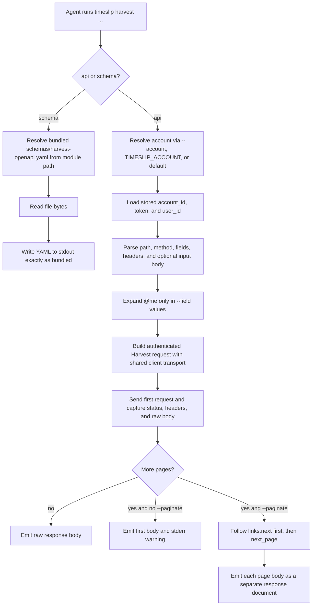

# timeslip Harvest API Commands Plan

## Overview

Add a small, explicit `harvest` command group that gives agents two low-level tools:

- `timeslip harvest api <path>` sends authenticated Harvest API requests using the currently resolved stored account.
- `timeslip harvest schema` prints the bundled `schemas/harvest-openapi.yaml` file verbatim so agents can inspect the API locally.

These commands should stay intentionally narrow. They are Harvest-specific escape hatches, not a new provider-neutral abstraction layer and not a second JSON envelope. The CLI should reuse existing account resolution, auth headers, `User-Agent`, debug logging, and secret-redaction behavior, while keeping the output as close to upstream Harvest behavior as possible.

The `harvest api --help` text should lead with the most important scoping warning in plain language:

> Harvest authentication selects an account, not an implicit current-user scope. Many list endpoints return account-wide data unless you pass filters such as `user_id`, `from`, `to`, or `is_running`.

That warning should be reinforced with concrete examples:

```text
timeslip harvest api /users/me
timeslip harvest api /time_entries -F user_id=@me -F from=2026-03-17
timeslip harvest api /time_entries -F user_id=@me -F is_running=true
timeslip harvest api /projects --paginate
timeslip harvest schema | rg '/time_entries'
```

Recommended command surface:

```text
timeslip harvest api <path> [options]
timeslip harvest schema
```

Recommended `harvest api` flags for v1:

- `-X, --method <verb>` with `GET` as the default
- `-F, --field <key=value>` repeatable; GET encodes query params, other methods build a flat JSON body; supports simple gh-like scalar coercion and `@me` expansion in values
- `-f, --raw-field <key=value>` repeatable literal string field; never expands `@me` and never coerces types
- `-H, --header <name:value>` repeatable extra request headers, except auth/account headers remain owned by the client
- `--input <file|->` raw request body from a file or stdin
- `--paginate` to follow Harvest pagination
- `-i, --include` to print status line and response headers before each emitted response body

Intentional non-goals for this change:

- no provider-agnostic `api` command
- no response wrapper or custom `timeslip` JSON envelope
- no schema filtering or schema regeneration step
- no `--jq`/templating features
- no attempt to clone all of `gh api`'s nested field grammar; complex payloads should use `--input`

## Workflow Diagram



## Command Contract

### `timeslip harvest api`

This command should behave as a thin authenticated proxy:

- Reuse `resolveAccount()` and the stored Harvest account profile. No new config surface.
- Reuse `HarvestClient` transport logic for auth headers, `User-Agent`, debug logging, and redaction. Add a raw-response path instead of a second handwritten fetch wrapper.
- Bypass the provider-neutral `Provider` interface. This command is intentionally Harvest-specific and should not distort the higher-level domain model to accommodate raw calls.

Path handling:

- Accept either a relative Harvest path that starts with `/` or an absolute URL.
- Absolute URLs must validate against the configured Harvest base URL prefix so pagination URLs from real Harvest and local mock servers are both accepted.
- Reject unrelated hosts or paths with a validation error.

Request-building rules:

- `--method` defaults to `GET`.
- `--field` on `GET` becomes query parameters.
- `--field` on non-`GET` requests builds a flat JSON object.
- `--raw-field` follows the same placement rules but always remains a string.
- `--input` sends raw bytes from a file or stdin and should be mutually exclusive with synthesized request bodies.
- Do not implement nested field parsing. Flat top-level fields are enough for Harvest; anything more complex should go through `--input`.
- `@me` is a small explicit convenience: if a `--field` value is exactly `@me`, replace it with the active account's stored `user_id`.
- Never auto-inject `user_id`. Agents must ask for it explicitly, usually via `-F user_id=@me`.
- Allow caller-supplied headers like `Content-Type`, but reject attempts to override `Authorization` or `Harvest-Account-Id`.

Type handling:

- `--field` should coerce obvious scalar literals in the same spirit as `gh api`: `true`, `false`, `null`, integers, and decimals become JSON scalars instead of strings.
- `--raw-field` exists for cases where the literal string matters.

Output contract:

- stdout receives the upstream Harvest response body, not a `timeslip` wrapper.
- Global `--json` does not change this command's output shape.
- For non-2xx HTTP responses, still print the response body to stdout, then exit non-zero.
- For config/auth resolution failures before the request is sent, keep the normal typed CLI errors.
- `204 No Content` should print nothing and still exit successfully.

Pagination:

- Inspect the first response for `links.next`; if absent, fall back to `next_page`.
- Without `--paginate`, emit only the first response body and print a stderr warning when more pages exist so records are never silently dropped.
- With `--paginate`, follow every page and emit each page body as its own response document, separated cleanly for streaming consumption. This keeps page payloads faithful to Harvest instead of guessing how to merge arbitrary endpoints.
- `--include` should prepend the status line and headers for each emitted response document.

### `timeslip harvest schema`

This command should be as simple and literal as possible:

- Resolve `schemas/harvest-openapi.yaml` relative to the installed module, not the current working directory.
- Read the file and write it to stdout byte-for-byte.
- Do not parse, filter, or reserialize the YAML.
- Do not make network calls.

## Implementation Plan

Files to add:

- `src/commands/harvest/harvest.ts`
- `src/commands/harvest/api.ts`
- `src/commands/harvest/schema.ts`

Files to update:

- `src/main.ts` to register the new `harvest` command group
- `src/cli/root.ts` to surface the new low-level Harvest commands in dense root help
- `src/providers/harvest/client.ts` to expose a raw request path that returns status, headers, and body without normal JSON parsing/error mapping

Implementation notes:

- Prefer a shared internal transport helper inside `HarvestClient` so `request()`, absolute-URL pagination, and the new raw mode all use the same header construction, base URL handling, network error handling, and debug logging.
- The raw transport should support both relative and validated absolute URLs.
- Keep `harvest schema` independent from code generation. It is a read-only reference command.
- Keep changes local to the new command group and the Harvest client; do not broaden the provider abstraction for this escape hatch.

## Tests

Snapshot coverage:

- `timeslip --help`
- `timeslip harvest --help`
- `timeslip harvest api --help`, asserting the account-vs-user scoping warning and examples are present
- `timeslip harvest schema --help`

Command tests for `harvest api`:

- GET query encoding from repeated `--field` / `--raw-field`
- non-GET JSON body construction from flat fields
- scalar coercion for `--field`
- literal-string behavior for `--raw-field`
- `@me` expansion only for explicit `--field` values
- no implicit `user_id` injection
- `--input` passthrough and validation against incompatible body-building flags
- extra-header parsing plus rejection of auth/account header overrides
- acceptance of relative paths and validated absolute pagination URLs
- rejection of unrelated absolute URLs
- raw stdout passthrough for 2xx, 4xx/5xx, and 204 responses
- pagination via both `links.next` and `next_page`
- stderr warning when pagination exists but `--paginate` is omitted
- `--include` output with raw responses

Command tests for `harvest schema`:

- stdout matches `schemas/harvest-openapi.yaml` exactly
- works regardless of current working directory

Safety tests:

- debug logs and error paths never expose tokens
- command output does not accidentally print stored credentials while resolving `@me`
