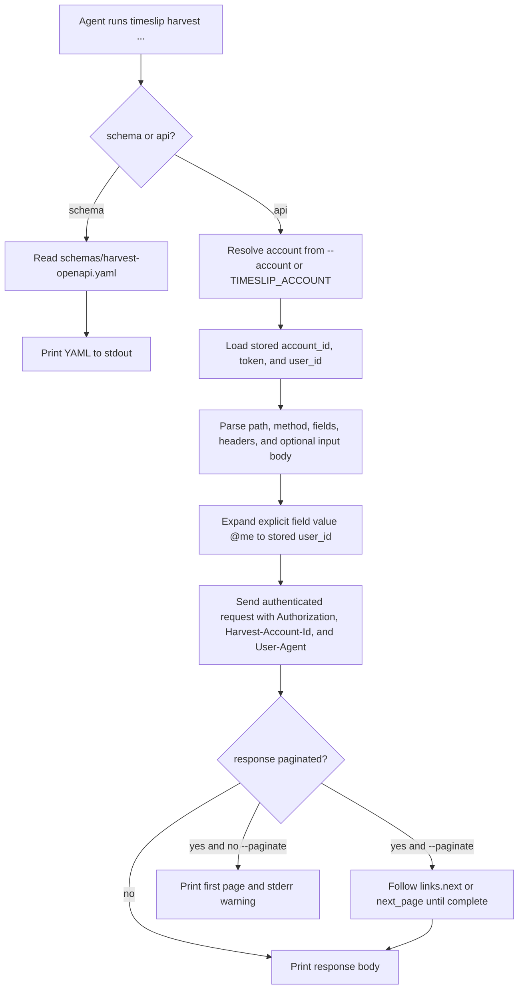

# timeslip Harvest API Commands Draft A

## Overview

Add a small Harvest-specific escape hatch for agents:

- `timeslip harvest api` makes authenticated Harvest API calls using the stored account, modeled after `gh api`.
- `timeslip harvest schema` prints the checked-in `schemas/harvest-openapi.yaml` file verbatim so agents can inspect the API surface locally.

This should stay intentionally narrow. The goal is not a generic provider abstraction or a second output layer. It is a practical way for an agent to:

- inspect any Harvest endpoint without writing ad hoc scripts
- reuse existing auth, account resolution, debug logging, and secret redaction
- avoid guessing endpoint shapes because the CLI can print the exact OpenAPI YAML already committed in the repo

Proposed command shape:

```text
timeslip harvest api <path>
timeslip harvest schema
```

Recommended `harvest api` flags for v1:

- `-X, --method <verb>` with `GET` as the default
- `-F, --field <key=value>` repeatable; on `GET`, encode as query params, otherwise build a JSON body
- `-H, --header <name:value>` repeatable for extra request headers
- `--input <file|- >` to send a raw request body instead of synthesized JSON
- `--paginate` to follow Harvest pagination via `links.next` first, then `next_page`
- `-i, --include` to print status line and response headers before the body

Key behavior decisions:

- Reuse the existing account resolution path from the rest of the CLI. `--account` and `TIMESLIP_ACCOUNT` should work unchanged.
- Reuse `HarvestClient` for auth headers, `User-Agent`, debug logging, and error mapping. Do not add a second code path that can leak tokens.
- Accept either a relative path like `/users/me` or an absolute Harvest API URL from `links.next`.
- Emit the upstream response body directly to stdout. Do not wrap it in an extra `timeslip` JSON envelope.
- If the first page clearly indicates more results and `--paginate` was not passed, print a stderr warning so pagination is never silently truncated.

The help text for `timeslip harvest api` should call out the most important Harvest quirk in plain language:

> Authentication identifies the account, not an implicit current-user scope. Many Harvest list endpoints return account-wide data unless you pass filters such as `user_id`, `from`, `to`, or `is_running`.

That warning should be followed by concrete examples, especially for the time-entry use case:

```text
timeslip harvest api /users/me
timeslip harvest api /time_entries -F user_id=@me -F from=2026-03-17
timeslip harvest api /time_entries -F user_id=@me -F is_running=true
timeslip harvest schema | rg '/time_entries'
```

To keep this easy for agents without hiding Harvest behavior, add one explicit convenience expansion:

- `@me` is only expanded when used as a `--field` value, and resolves to the stored Harvest `user_id`
- the command must never auto-inject `user_id` on its own

`timeslip harvest schema` should:

- read `schemas/harvest-openapi.yaml`
- print the YAML exactly as checked in
- avoid any network call or regeneration step

## Workflow Diagram



## Implementation Sketch

- Add `src/commands/harvest/harvest.ts`, `src/commands/harvest/api.ts`, and `src/commands/harvest/schema.ts`.
- Wire the new `harvest` command group into [src/main.ts](/home/exedev/workspace/timeslip/src/main.ts) and the dense root help in [src/cli/root.ts](/home/exedev/workspace/timeslip/src/cli/root.ts).
- Extend [src/providers/harvest/client.ts](/home/exedev/workspace/timeslip/src/providers/harvest/client.ts) with a low-level request path that can return raw response status, headers, and body while keeping the current auth and error behavior.
- Reuse existing config loading from [src/config/mod.ts](/home/exedev/workspace/timeslip/src/config/mod.ts) so `@me` can resolve from the stored `user_id`.
- Keep `harvest schema` separate from code generation. It is a read-only reference command, not a build step.

## Tests

- Root help and `timeslip harvest --help` snapshot coverage.
- `harvest api` GET coverage for query-field encoding and direct body passthrough.
- `harvest api` non-GET coverage for JSON body construction from repeated `--field`.
- `@me` expansion coverage proving that only explicit field values expand and that no implicit `user_id` is added.
- Pagination coverage for both `links.next` and `next_page`, plus the warning path when `--paginate` is omitted.
- `harvest schema` coverage that asserts stdout matches [schemas/harvest-openapi.yaml](/home/exedev/workspace/timeslip/schemas/harvest-openapi.yaml) exactly.
