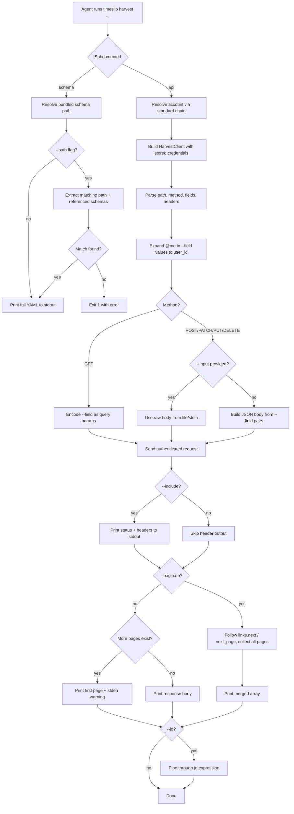

# timeslip Harvest API Commands Draft B

## Overview

Two new commands give agents direct, authenticated access to the Harvest API without leaving the CLI:

- `timeslip harvest api <path>` — send an authenticated request to any Harvest v2 endpoint, inspired by `gh api`.
- `timeslip harvest schema` — dump the bundled OpenAPI YAML so agents can discover endpoints, parameters, and response shapes without a browser.

### Design philosophy

The `harvest api` command is a **thin authenticated proxy**, not an abstraction layer. It sends exactly what you ask, returns exactly what Harvest returns, and never mutates the response. This is deliberate: agents already know how to parse JSON, and wrapping Harvest's responses in a second envelope creates ambiguity about which schema to trust.

The single most important thing the help text must communicate is:

> **Harvest API endpoints are account-scoped, not user-scoped.** Listing time entries, expenses, or invoices returns data for all users in the account unless you explicitly filter by `user_id`. Use `-F user_id=@me` to scope requests to the authenticated user.

This is the #1 source of confusion for agents (and humans) new to Harvest.

### Command surface

```
timeslip harvest api <path> [options]
timeslip harvest schema [options]
```

#### `harvest api` flags

| Flag                      | Short | Description                                                                                          | Default |
| ------------------------- | ----- | ---------------------------------------------------------------------------------------------------- | ------- |
| `--method <verb>`         | `-X`  | HTTP method                                                                                          | `GET`   |
| `--field <key=value>`     | `-F`  | Repeatable. GET: query params. Other methods: JSON body fields. Supports `@me` expansion for values. | —       |
| `--raw-field <key=value>` | `-f`  | Like `--field` but never expands `@me` or performs type coercion                                     | —       |
| `--header <name:value>`   | `-H`  | Repeatable extra request headers                                                                     | —       |
| `--input <file\|->`       | —     | Raw body from file or stdin (mutually exclusive with `--field` on non-GET)                           | —       |
| `--paginate`              | —     | Follow `links.next` / `next_page` and concatenate results into a single JSON array                   | —       |
| `--include`               | `-i`  | Print HTTP status line and response headers before the body                                          | —       |
| `--jq <expr>`             | `-q`  | Post-process response JSON through a jq expression (requires `jq` on PATH)                           | —       |
| `--silent`                | —     | Suppress the pagination warning on stderr                                                            | —       |

#### `harvest schema` flags

| Flag                | Short | Description                                                           | Default |
| ------------------- | ----- | --------------------------------------------------------------------- | ------- |
| `--path <endpoint>` | `-p`  | Filter schema output to a single endpoint path (e.g. `/time_entries`) | —       |

### Key behaviors

**Account resolution.** Reuses the standard `--account` / `TIMESLIP_ACCOUNT` / stored-default chain. No new config surface.

**Auth plumbing.** Reuses `HarvestClient` for `Authorization`, `Harvest-Account-Id`, `User-Agent`, debug logging, and token redaction. A single code path handles credentials — no second fetch wrapper.

**Path handling.** Accepts relative paths (`/users/me`) or absolute Harvest URLs (`https://api.harvestapp.com/api/v2/...`). Absolute URLs are validated against the Harvest domain before sending, matching the existing `requestAbsolute` guard.

**Response passthrough.** stdout receives the raw Harvest JSON body. No envelope, no transformation. When `--paginate` is active, the command collects all pages into a single JSON array of the resource objects (stripping the pagination wrapper from each page).

**Pagination.**

1. If the response contains `links.next`, follow it.
2. Fall back to `next_page` if `links.next` is absent.
3. Without `--paginate`: emit only the first page and print a stderr warning if additional pages exist (unless `--silent`).
4. With `--paginate`: concatenate all pages. The output key is inferred from the first page's top-level array key (e.g. `time_entries`, `projects`). The final output is the merged array, not a wrapper object.

**`@me` expansion.** When `@me` appears as a field _value_ (not key), it resolves to the stored `user_id` from the active account. This only fires for `--field`, never for `--raw-field` or `--input`. The command never silently injects `user_id` — the agent must ask for it.

**`--jq` post-processing.** Pipes the response body through `jq` for lightweight extraction. This is optional and fails gracefully if `jq` is not installed. This keeps the command composable without forcing agents to shell out.

**Error mapping.** Harvest error responses are printed to stdout as-is (they are valid JSON). The exit code reflects the HTTP status: 0 for 2xx, 1 otherwise. `--include` makes the status visible in the output.

### Help text examples

The help text should lead with the scoping warning and follow with practical examples:

```
EXAMPLES:
  # Get the authenticated user
  timeslip harvest api /users/me

  # List YOUR time entries for today (note: user_id is required)
  timeslip harvest api /time_entries -F user_id=@me -F from=2026-03-17

  # List YOUR running timers
  timeslip harvest api /time_entries -F user_id=@me -F is_running=true

  # List all projects (paginated)
  timeslip harvest api /projects --paginate

  # Create a time entry
  timeslip harvest api /time_entries -X POST \
    -F project_id=123 -F task_id=456 -F spent_date=2026-03-17 -F hours=1.5

  # Pipe a complex body from a file
  timeslip harvest api /time_entries -X POST --input payload.json

  # Look up endpoint shapes
  timeslip harvest schema
  timeslip harvest schema --path /time_entries
```

### `harvest schema` behavior

- Reads the bundled `schemas/harvest-openapi.yaml` at the installed package path (not CWD).
- Prints YAML verbatim to stdout. No network call, no regeneration.
- With `--path <endpoint>`: extracts only the matching path entry and its referenced schemas, printing a focused subset. This makes it practical for agents to learn one endpoint without processing 475 KB of YAML.
- Exit code 0 on success, 1 if `--path` matches nothing.

## Workflow Diagram



## Implementation Plan

### File changes

| File                              | Action | Purpose                                            |
| --------------------------------- | ------ | -------------------------------------------------- |
| `src/commands/harvest/mod.ts`     | Create | `harvest` command group with description           |
| `src/commands/harvest/api.ts`     | Create | `harvest api` subcommand                           |
| `src/commands/harvest/schema.ts`  | Create | `harvest schema` subcommand                        |
| `src/main.ts`                     | Edit   | Register `harvest` command group                   |
| `src/cli/root.ts`                 | Edit   | Add harvest group to dense root help               |
| `src/providers/harvest/client.ts` | Edit   | Add `requestRaw()` returning status, headers, body |

### Implementation details

**`requestRaw()` on HarvestClient.** The existing `request<T>()` method parses JSON and maps errors. `harvest api` needs the raw response (status, headers, body text) to support `--include` and non-JSON responses. Add a `requestRaw(path, options)` method that:

- Sets the same auth headers
- Runs the same debug logging
- Returns `{ status: number, headers: Headers, body: string }`
- Does NOT parse JSON or map errors

This keeps the existing error-mapping path untouched and gives `harvest api` full control over output.

**Paginated concatenation.** When `--paginate` is active:

1. Parse each page's JSON.
2. Identify the resource key (first key whose value is an array).
3. Accumulate all items.
4. Output the final merged array (just the array, not a wrapper).

**`--jq` execution.** Shell out to `jq` via `Deno.Command`. If `jq` is not found, print a clear error suggesting installation. This is simpler than bundling a jq implementation.

**Schema path filtering.** Parse the YAML with `@std/yaml`, extract the matching path object and walk `$ref` pointers to collect referenced schemas, then re-serialize the subset. This keeps the output valid YAML that agents can parse.

## Tests

### Snapshot tests

- `timeslip --help` and `timeslip harvest --help` snapshots updated.
- `timeslip harvest api --help` snapshot confirms the scoping warning and examples are present.
- `timeslip harvest schema --help` snapshot.

### Unit tests (`src/commands/harvest/api_test.ts`)

- **GET field encoding**: `--field` pairs become query parameters.
- **POST body construction**: `--field` pairs become JSON body; numeric/boolean values coerced.
- **`--raw-field`**: no `@me` expansion, no type coercion.
- **`@me` expansion**: resolves to stored `user_id`; only in `--field` values.
- **`--input` body**: reads file content; errors if combined with `--field` on non-GET.
- **`--include` output**: status line and headers printed before body.
- **Pagination follow**: mock returning 2 pages via `links.next`; verify merged array output.
- **Pagination warning**: mock returning paginated response without `--paginate`; verify stderr warning.
- **`--silent`**: suppresses pagination warning.
- **Error passthrough**: 4xx/5xx body printed to stdout, exit code 1.
- **Secret redaction**: assert no tokens appear in any output path.

### Unit tests (`src/commands/harvest/schema_test.ts`)

- **Full dump**: stdout matches bundled `schemas/harvest-openapi.yaml` byte-for-byte.
- **`--path` filter**: returns only the matching path and referenced schemas.
- **`--path` miss**: exit code 1, error message on stderr.

### E2E tests

- `timeslip harvest api /users/me` with mock server returns expected JSON.
- `timeslip harvest api /time_entries -F user_id=@me -F from=2026-03-17` expands `@me` and sends correct query string.
- `timeslip harvest schema` prints YAML to stdout.

## Differences from Draft A

| Aspect           | Draft A            | Draft B                                                           |
| ---------------- | ------------------ | ----------------------------------------------------------------- |
| `--raw-field`    | Not included       | Added for literal values without expansion                        |
| `--jq`           | Not included       | Optional post-processing pipe                                     |
| `--silent`       | Not included       | Suppresses pagination warning                                     |
| Schema filtering | Full dump only     | `--path` flag for focused endpoint extraction                     |
| Paginated output | Unspecified format | Merged array (unwrapped from pagination envelope)                 |
| Error exit codes | Not specified      | HTTP-status-aware: 0 for 2xx, 1 otherwise                         |
| Type coercion    | Not specified      | `--field` coerces numeric/boolean strings; `--raw-field` does not |
