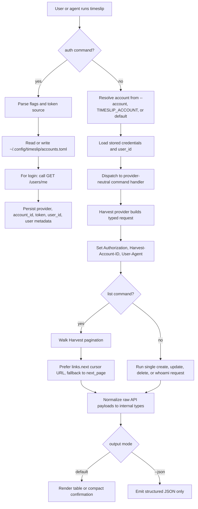

# timeslip v1 Plan

## Overview

`timeslip` will ship as a non-interactive Deno CLI for managing Harvest time entries, following the strongest `linear-cli` patterns where they fit: Cliffy for commands, strict TypeScript, generated API types, explicit error classes, runtime validation at system boundaries, and snapshot-heavy tests.

Core product goals for v1:

- add, update, remove, and list Harvest time entries
- list the authenticated user's projects and clients
- support login/logout plus multiple stored Harvest accounts
- persist the resolved Harvest `user_id` in XDG config
- work well for both humans and agents with stable `--json` output
- never silently truncate paginated results

Guiding decisions:

- Harvest is the only shipping provider in v1, but command handlers depend on provider-neutral domain types so another provider can be added later without rewriting the CLI.
- There is no repo-local or cwd-local config. Everything auth-related lives in XDG config so the CLI can run anywhere.
- Because the credentials are live secrets, the auth flow must support safe non-interactive input (`--token-stdin` and `--token-env`) in addition to plain `--token`, and tokens must always be redacted from logs, errors, fixtures, and snapshots.
- Running `timeslip` with no arguments should print a dense root overview that lists command groups, common subcommands, and important flags so agents can discover the surface area in one call.
- Human output defaults to terse tables and confirmations. Agent output uses `--json`. A separate `--robot` mode is out of scope for v1 so there is only one machine-readable contract to maintain and snapshot-test.
- V1 stays focused. No TUI, no prompts, no keyring, no repo awareness, no local cache, and no dedicated timer start/stop commands yet.

## Workflow Diagram



## Scope and CLI Shape

Top-level shape:

```text
timeslip [--account <name>] [--json] <command>

timeslip auth login
timeslip auth list
timeslip auth default <name>
timeslip auth whoami
timeslip auth logout <name>

timeslip entry add
timeslip entry update <entry-id>
timeslip entry remove <entry-id>
timeslip entry list

timeslip project list
timeslip client list
```

Command rules:

- Use noun-first command groups in the style of `gh`.
- Invoking `timeslip` with no subcommand prints the root help overview and exits successfully instead of failing with a usage error.
- The root help output should be intentionally dense: show command groups, representative subcommands, and the global flags plus each command's key flags in a compact, scan-friendly layout.
- `--account` is a global flag available on every command that touches provider state.
- Commands never prompt for missing input. Invalid or incomplete input fails with a typed validation error and a concrete fix.
- Every structured command supports `--json`.

Command details:

1. `timeslip auth login --account <name> [--account-id <id>] (--token <token> | --token-stdin | --token-env <VAR>) [--overwrite]`

- Calls `GET /users/me` to verify credentials and resolve `user_id`.
- Stores `provider = "harvest"` plus `account_id`, `token`, `user_id`, and basic user metadata.
- If `--account-id` is omitted, parse it from the Harvest PAT prefix when possible; otherwise fail with a clear error.
- The first successful login becomes the default account.
- `--overwrite` is required to replace an existing profile.

2. `timeslip auth list`

- Shows configured accounts, provider, account id, user, and the default marker.
- Never prints tokens.

3. `timeslip auth default <name>`

- Sets the named account as default.

4. `timeslip auth whoami`

- Resolves the active account the same way provider commands do.
- Re-validates credentials with Harvest and prints the stored and remote identity summary.

5. `timeslip auth logout <name>`

- Removes the stored account.
- If the removed account was the default and exactly one account remains, promote it automatically; otherwise clear the default.

6. `timeslip entry add --project-id <id> --task-id <id> --date <YYYY-MM-DD> [--hours <decimal>] [--description <text>]`

- Omitting `--hours` starts a running timer, matching Harvest behavior.
- Reject `--hours 0` on create so the CLI does not silently trigger Harvest's "start timer" quirk when the user intended a stopped zero-hour entry.
- Returns the created entry with id, date, client, project, task, hours, running state, and description.

7. `timeslip entry update <entry-id> [--description <text> | --clear-description] [--hours <decimal>] [--date <YYYY-MM-DD>] [--project-id <id>] [--task-id <id>]`

- Only sends fields explicitly provided by the user.
- Rejects an empty patch.
- `--clear-description` is the supported way to blank out notes without shell ambiguity.

8. `timeslip entry remove <entry-id>`

- Deletes the entry without a confirmation prompt.
- Human mode prints a compact confirmation.
- JSON mode returns a minimal machine-readable success payload.

9. `timeslip entry list [--today | --from <YYYY-MM-DD> --to <YYYY-MM-DD> | --all] [--running] [--project-id <id>] [--client-id <id>] [--limit <n>] [--page-size <n>]`

- Defaults to `--today` if no date scope flag is provided, so the common case stays bounded and fast.
- Always includes the stored `user_id` in Harvest requests.
- Walks every page in the requested scope unless `--limit` stops collection first.

10. `timeslip project list [--limit <n>] [--page-size <n>]`

- Uses `/users/me/project_assignments`.
- Human output includes project id, project name, client, and task ids/names needed for `entry add`.
- JSON output includes the full assigned task list per project.

11. `timeslip client list [--limit <n>] [--page-size <n>]`

- Also derives from `/users/me/project_assignments`, never `/clients`.
- Deduplicates clients by id.
- JSON output includes the projects associated with each listed client so agents do not need a second call to map projects back to clients.

## Config and Credential Storage

Config file location:

```text
~/.config/timeslip/accounts.toml
```

Respect `XDG_CONFIG_HOME` on Unix-like systems and the platform-appropriate user config directory on Windows. Use restrictive permissions where the OS supports them and write atomically via temp file + rename so concurrent failures do not corrupt the store.

Proposed file shape:

```toml
default = "acme"

[accounts.acme]
provider = "harvest"
account_id = 123456
token = "123456.pt.secret"
user_id = 987654
user_name = "Jane Developer"
user_email = "jane@example.com"
```

Resolution order:

1. `--account`
2. `TIMESLIP_ACCOUNT`
3. stored `default`

Rules:

- Account names are user-provided profile labels, not inferred from cwd.
- Tokens are never printed by the CLI in normal mode or debug mode.
- There is no v1 command to reveal stored tokens.
- Config parsing and environment-derived settings should be runtime-validated so corrupted TOML produces a clear config error instead of an untyped crash.

## Architecture

Recommended layout:

```text
deno.json
schemas/
  harvest-openapi.yaml
src/
  main.ts
  version.ts
  cli/
    root.ts
  commands/
    auth/
    entry/
    project/
    client/
  config/
    accounts.ts
    resolve.ts
  domain/
    types.ts
  errors/
    mod.ts
  output/
    table.ts
    json.ts
  providers/
    mod.ts
    types.ts
    pagination.ts
    harvest/
      auth.ts
      client.ts
      mapper.ts
      generated/
        harvest.openapi.ts
test/
  commands/
  config/
  providers/
  fixtures/
```

Provider boundary:

- Commands operate on provider-neutral domain types such as `Entry`, `ProjectAssignment`, `ClientSummary`, and `AccountProfile`.
- Harvest-specific HTTP details, request/response types, and response quirks stay under `src/providers/harvest/`.
- List methods should expose incremental iteration plus pagination metadata so commands can honor `--limit` efficiently and still return `pages_fetched`, `total_entries`, and `truncated` in JSON output.

## Harvest Integration

Implementation requirements:

- Generate and commit TypeScript types from `schemas/harvest-openapi.yaml`.
- Add `deno task codegen` to regenerate `src/providers/harvest/generated/harvest.openapi.ts`.
- Exclude generated files from fmt and lint.
- Read the CLI version from `deno.json` and send `User-Agent: @schpet/timeslip/<version>` on every request.
- Send both required Harvest auth headers:
  - `Authorization: Bearer <token>`
  - `Harvest-Account-ID: <account_id>`
- Use base URL `https://api.harvestapp.com/api/v2`, even if schema examples still reference `/v2`.
- Accept absolute pagination URLs from Harvest `links.next`, even when they use `/v2`, and prefer them over `next_page` because cursor pagination is less likely to skip or duplicate records while data changes.
- Always pass `user_id=<stored_user_id>` when listing time entries.
- Use `/users/me/project_assignments` for project and client discovery because it is already scoped to the authenticated user and includes task assignments.
- Normalize Harvest responses into internal types before rendering so CLI output is stable even if the generated API shapes are noisy.

## Output and Exit Contract

Human mode:

- Default to terse tables for list commands and compact confirmations for mutations.
- Keep output close to `gh`: minimal prose, predictable columns, no decorative noise.
- The zero-argument root help is part of the human-mode contract and should act as a compact command index rather than a sparse usage banner.

JSON mode:

- Emit structured JSON only, with no banners or explanatory text.
- List responses include both items and pagination metadata.
- JSON shapes are treated as a public contract and covered by snapshots.

Exit codes:

- `0` success
- `2` usage or validation failure
- `4` auth failure
- `1` provider, network, config, or unexpected runtime failure

## Errors, Validation, and Safety

Use explicit error classes modeled after `linear-cli`:

- `CliError`
- `ValidationError`
- `AuthError`
- `NotFoundError`
- `ConfigError`
- `ProviderError`

Behavior rules:

- `401` and `403` map to `AuthError`.
- `404` for a targeted entry id maps to `NotFoundError`.
- `422` Harvest validation responses preserve the useful server message.
- `429` surfaces `Retry-After` in the error message.
- `TIMESLIP_DEBUG=1` may print request context, response status, and stack traces, but must still redact tokens and auth headers.

## Testing Strategy

Unit tests:

- config path resolution and atomic TOML read/write
- default-account resolution and logout edge cases
- token redaction helpers
- pagination logic with `links.next`, `next_page` fallback, `--limit`, and broken metadata
- response normalization and output formatting
- version-to-user-agent plumbing

Provider tests:

- auth header and user-agent construction
- `/users/me` login flow and `user_id` persistence
- time entry create, update, delete, and scoped list behavior
- project assignment pagination and client deduplication
- error mapping for `401`, `404`, `422`, and `429`

Command tests:

- `--help` snapshots for every command
- zero-argument `timeslip` snapshot covering the dense root overview
- human output snapshots
- `--json` snapshots
- validation failures and exit codes
- `auth login --token-stdin` and `--token-env` flows

Integration tests:

- a mock Harvest server with multi-page fixtures and absolute `links.next` URLs
- end-to-end command sequences: login -> list projects -> add entry -> update entry -> remove entry
- no live credentials and no real network calls in CI

## Delivery Phases

### Phase 1: Skeleton and Codegen

- initialize the Deno project
- wire the root Cliffy command tree, global flags, and zero-argument dense help overview
- add version plumbing and code generation
- establish test helpers and snapshot infrastructure

### Phase 2: Config and Auth

- implement XDG config storage and account resolution
- add safe login inputs, default-account handling, and logout behavior
- persist `user_id` and verify secret redaction

### Phase 3: Harvest Client and Pagination

- implement the Harvest HTTP client, provider boundary, and paginator
- normalize Harvest error shapes
- return stable domain types plus pagination metadata

### Phase 4: Entry Commands

- implement `entry add`, `entry update`, `entry remove`, and `entry list`
- add human and JSON rendering
- cover the create-time `hours = 0` guard and description clearing behavior

### Phase 5: Project and Client Discovery

- implement `project list` and `client list` from project assignments
- expose task ids and names in a way that makes `entry add` practical
- finish pagination, output, and error-path coverage

### Phase 6: Hardening

- close remaining test gaps
- audit every output path for token leakage
- document output contracts and core command examples
