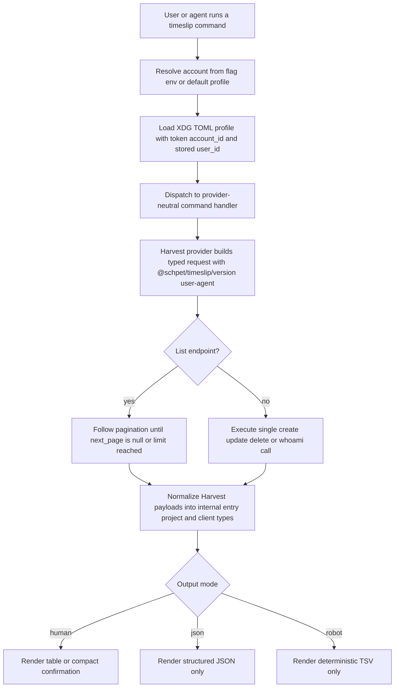

# timeslip Draft A

## Overview

`timeslip` should start as a Deno CLI with a small provider abstraction, a Harvest-first implementation, and a command surface that works equally well for humans and agents.

Recommended shape:

- Follow the same broad patterns as `/home/exedev/workspace/linear-cli`: Deno, Cliffy commands, generated API types, strict TypeScript, explicit error classes, and snapshot-heavy command tests.
- Do not add repo-local or cwd-local config. All auth and defaults live in the XDG config directory so the CLI can run from anywhere.
- Treat Harvest as the only shipping provider in v1, but isolate it behind a provider interface so a future `toggl` or `clockify` provider does not force a CLI rewrite.
- Default human output should be readable tables. Agent output should be explicit and stable via `--json` and `--robot`.
- Pagination must never silently truncate results. List commands should either walk all pages or stop because the user asked for a limit.

Product goals for v1:

- Log time entries.
- Update time entries, including descriptions.
- Remove time entries.
- List the authenticated user's available projects and clients.
- Persist account credentials plus the resolved Harvest `user_id`.
- Generate and commit Harvest API types from the checked-in OpenAPI schema.
- Ship with full automated coverage around auth, pagination, provider client behavior, and top-level commands.

Non-goals for v1:

- Interactive TUIs, prompt-driven flows, or fuzzy pickers.
- Repo-aware behavior like the Linear CLI's project config.
- Keyring integration.
- General support for every Harvest endpoint.

## CLI Shape

Top-level command families:

```text
timeslip auth login
timeslip auth list
timeslip auth default
timeslip auth whoami
timeslip auth logout

timeslip entry add
timeslip entry update
timeslip entry remove
timeslip entry list

timeslip project list
timeslip client list
```

Command design rules:

- Keep commands noun-first like `gh` and `linear`.
- No interactive prompts in the default implementation. If required input is missing, fail with a clear validation error.
- Every data-returning command supports `--json`.
- Commands that benefit from compact shell output also support `--robot`, which emits tab-separated, colorless, headerless rows with a documented field order.
- Human mode uses tables with narrow, predictable columns and truncation rules.

Initial command details:

1. `timeslip auth login --provider harvest --account <name> --account-id <id> --token <token>`

- Calls `GET /users/me`.
- Persists the account profile, API token, and resolved `user_id`.
- First successful login becomes the default account unless one already exists.
- Prints the account, user, and provider summary.

2. `timeslip auth list`

- Shows configured accounts and the default marker.
- `--json` returns the full stored metadata except secrets unless `--include-token` is explicitly requested.

3. `timeslip auth whoami`

- Resolves the current account the same way the main client does.
- Verifies credentials against Harvest and prints the stored `user_id`.

4. `timeslip entry add`

- Required: `--project-id`, `--task-id`, `--date`.
- Optional: `--hours`, `--description`.
- Omitting `--hours` starts a running timer, matching Harvest behavior.
- Returns the created entry with ID, project, task, date, hours, running state, and notes.

5. `timeslip entry update <entry-id>`

- Supports `--description`, `--hours`, `--date`, `--project-id`, `--task-id`.
- Sends only explicitly provided fields.
- Rejects empty update payloads with a validation error.

6. `timeslip entry remove <entry-id>`

- Deletes the entry and prints a compact confirmation.
- In `--json`, return `{ "ok": true, "id": ... }`.

7. `timeslip entry list`

- Filters: `--from`, `--to`, `--today`, `--running`, `--project-id`, `--client-id`, `--page-size`, `--limit`.
- Always scopes Harvest queries with the stored `user_id`.
- By default walks every page until `next_page` is `null` or `--limit` is satisfied.

8. `timeslip project list`

- Uses `/users/me/project_assignments`.
- Displays project, client, assignment status, and available task names.

9. `timeslip client list`

- Also derives from `/users/me/project_assignments` so we only show clients the authenticated user can actually log time against.
- Deduplicates clients by ID and can optionally include assigned projects.

## Auth and Config

Store config in XDG config space, following the same cross-platform path logic as `linear-cli`, but keeping everything in one plaintext TOML file for v1.

Recommended file:

```text
~/.config/timeslip/accounts.toml
```

Proposed shape:

```toml
default = "harvest-acme"

[accounts.harvest-acme]
provider = "harvest"
label = "Acme"
account_id = 123456
token = "123456.pt.secret"
user_id = 987654
user_name = "Jane Developer"
user_email = "jane@example.com"
```

Rules:

- Account key is a user-provided profile name, not inferred from cwd.
- Support multiple Harvest accounts from day one.
- Never print tokens in normal output, errors, or snapshots.
- `auth login` overwrites an existing profile only with an explicit `--overwrite`.
- The resolved client chooses the account by:
  1. `--account`
  2. `TIMESLIP_ACCOUNT`
  3. stored default
- Because the prompt notes the credentials are live, logs, fixtures, and error paths should always redact secrets.

## Provider Architecture

Keep the provider boundary small and explicit.

Suggested layout:

```text
src/
  main.ts
  cli/
  commands/
  config/
  errors/
  output/
  providers/
    mod.ts
    types.ts
    pagination.ts
    harvest/
      client.ts
      auth.ts
      mapper.ts
      generated/
        harvest.openapi.ts
```

Provider interface:

- `login(input): Promise<AccountProfile>`
- `whoAmI(account): Promise<AccountIdentity>`
- `listEntries(account, query): Promise<Page<Entry>>`
- `createEntry(account, input): Promise<Entry>`
- `updateEntry(account, id, patch): Promise<Entry>`
- `deleteEntry(account, id): Promise<void>`
- `listProjectAssignments(account, query): Promise<Page<ProjectAssignment>>`

Rationale:

- Command modules depend on provider-neutral domain types.
- Harvest-specific request/response quirks stay under `providers/harvest/`.
- A future provider can plug into the same command contracts with minimal churn.

## Harvest Integration Details

Important implementation details to encode directly into the plan:

- Use `schemas/harvest-openapi.yaml` as the canonical source for generated request/response types.
- Override the base URL to `https://api.harvestapp.com/api/v2`, since the checked-in schema still references `/v2`.
- Set `User-Agent` to `@schpet/timeslip/$version` on every request.
- Send both required auth headers:
  - `Authorization: Bearer <token>`
  - `Harvest-Account-ID: <account_id>`
- Always scope time-entry listing to the stored `user_id`. This is mandatory so `timeslip` does not accidentally show entries for the whole Harvest account.
- Use `/users/me/project_assignments` rather than `/clients` so client and project listings stay user-scoped.
- Normalize Harvest responses into stable internal types before rendering so the CLI output does not depend on raw API shape.

## Code Generation

Add a dedicated codegen task and treat generated types as committed source.

Recommended approach:

- Add `deno task codegen`.
- Generate `src/providers/harvest/generated/harvest.openapi.ts` from `schemas/harvest-openapi.yaml`.
- Wrap generated types with small handwritten helpers for the actual endpoints we use, rather than scattering raw OpenAPI names throughout command code.

Generated-code rules:

- Regenerate types whenever the schema changes.
- Do not hand-edit generated files.
- Keep handwritten mapping code small and easy to audit.

## Output Modes

Human output:

- Default to table output for `entry list`, `project list`, and `client list`.
- Use stable column order and consistent formatting for dates, decimal hours, and running timers.
- Keep prose minimal; the CLI should feel close to `gh`.

Agent output:

- `--json` returns structured data with no extra prose.
- `--robot` returns deterministic TSV for shell pipelines.
- `--robot` also disables colors, spinners, decorative headers, and summary text.
- Document the robot field order in command help and snapshot tests.

## Pagination Strategy

Pagination needs a shared implementation instead of ad hoc loops in commands.

Requirements:

- Central helper that follows Harvest `next_page`, `total_pages`, and `total_entries`.
- Detect loops or inconsistent pagination metadata and fail loudly.
- Default page size should be Harvest's max safe page size for the endpoint.
- `--limit` should stop after enough records have been gathered, not after an arbitrary page.
- When returning JSON for list commands, include pagination metadata: `page_size`, `pages_fetched`, `total_entries`, and `truncated`.

This avoids the most common CLI failure mode for Harvest: only reading page 1 and silently missing older records.

## Errors and Validation

Adopt the `linear-cli` style of explicit, typed failures.

Recommended error classes:

- `CliError`
- `ValidationError`
- `AuthError`
- `NotFoundError`
- `ProviderError`

Rules:

- Invalid flag combinations fail immediately with a helpful suggestion.
- HTTP 401 and 403 responses become `AuthError`.
- HTTP 404s for specific entry IDs become `NotFoundError`.
- Provider error bodies should be surfaced in a compact, readable way.
- Debug mode may include request IDs and raw payload details, but normal mode should stay terse and safe.

## Testing Strategy

Everything in scope should be covered before v1 is considered complete.

Test layers:

1. Unit tests

- config path resolution and TOML parsing
- auth store read/write and default-account selection
- redaction helpers
- pagination helper behavior, including multi-page and broken-page cases
- Harvest mapper normalization

2. Provider/client tests

- request headers, including `User-Agent`
- `/users/me` login flow and `user_id` persistence
- `/time_entries` create, update, delete, and paginated list flows
- `/users/me/project_assignments` project/client listing

3. Command tests

- help output snapshots
- human table snapshots
- `--json` snapshots
- `--robot` snapshots
- validation and error snapshots

4. End-to-end smoke tests

- run commands against a mock Harvest HTTP server with multi-page fixtures
- verify no tests rely on live credentials or real network calls

## Phased Delivery

### Phase 1: Project skeleton and generated types

- Create the Deno project structure.
- Wire Cliffy command registration.
- Add version plumbing for the `User-Agent`.
- Add OpenAPI code generation from `schemas/harvest-openapi.yaml`.

### Phase 2: Auth and account resolution

- Implement XDG TOML storage.
- Add `auth login`, `auth list`, `auth default`, `auth whoami`, `auth logout`.
- Persist `user_id` from `/users/me`.

### Phase 3: Harvest provider and entry commands

- Implement the Harvest HTTP client and pagination helper.
- Add `entry add`, `entry update`, `entry remove`, `entry list`.
- Normalize human, JSON, and robot output.

### Phase 4: Project and client discovery

- Add `project list` and `client list` from project assignments.
- Deduplicate and format client data cleanly.
- Cover agent-friendly output modes.

### Phase 5: Hardening

- Fill testing gaps.
- Add docs for auth, output modes, and command examples.
- Audit error messages for secret redaction and actionable suggestions.

## Workflow Diagram



## Open Questions

- The planner prompt includes a truncated line, `the credentials are LIVE: when`. I am assuming this means we must treat tokens as real secrets and avoid logging or snapshotting them anywhere.
- Whether `entry add` should expose explicit timer verbs in v1 or only the Harvest create semantics of `hours omitted = running timer`.
- Whether `client list` should default to one row per client or one row per client/project pairing when `--robot` is used.
