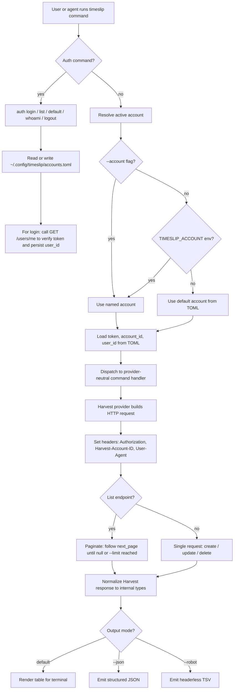

# timeslip v1 Plan - Draft B

## Overview

timeslip is a non-interactive CLI for managing Harvest time entries, designed for both human and agent use. It follows the patterns established by `linear-cli`: Deno runtime, Cliffy command framework, generated API types, strict TypeScript, explicit error classes, and snapshot-driven tests.

Key design decisions:

- **Harvest-first, provider-ready**: v1 targets Harvest exclusively but isolates all Harvest-specific code behind a provider interface so future backends (Toggl, Clockify) slot in without CLI rewrites.
- **No interactive UI**: All input comes from flags and arguments. Missing required input fails with a clear error and suggestion, never a prompt. This makes the CLI predictable for agent callers.
- **Dual output modes**: Human-readable tables by default, `--json` for structured data, `--robot` for deterministic TSV suitable for shell pipelines. Agents should use `--json` or `--robot`.
- **Run-anywhere config**: No cwd or repo-level configuration. Auth and account state live in `~/.config/timeslip/accounts.toml` (XDG). Multiple Harvest accounts are supported from day one.
- **Complete pagination**: List commands walk all pages by default. They never silently truncate. A `--limit` flag stops after collecting enough records, not after an arbitrary page.
- **Generated types**: TypeScript types are generated from `schemas/harvest-openapi.yaml` and committed to the repo. A `deno task codegen` regenerates them.
- **User agent**: Every HTTP request sends `User-Agent: @schpet/timeslip/<version>` where version comes from `deno.json`.

## Workflow Diagram



## CLI Command Surface

Commands are noun-first, following `gh` and `linear` conventions.

### Auth

| Command                        | Description                                      |
| ------------------------------ | ------------------------------------------------ |
| `timeslip auth login`          | Store credentials and verify against `/users/me` |
| `timeslip auth list`           | Show configured accounts with default marker     |
| `timeslip auth default <name>` | Set the default account                          |
| `timeslip auth whoami`         | Verify current credentials and print user info   |
| `timeslip auth logout <name>`  | Remove a stored account                          |

`auth login` flags: `--account <name>` (profile name), `--account-id <id>`, `--token <token>`. On success it calls `GET /users/me`, persists the `user_id`, and prints a summary. First login becomes the default.

### Time Entries

| Command                      | Description                        |
| ---------------------------- | ---------------------------------- |
| `timeslip entry add`         | Create a time entry                |
| `timeslip entry update <id>` | Update fields on an existing entry |
| `timeslip entry remove <id>` | Delete a time entry                |
| `timeslip entry list`        | List time entries with filters     |

`entry add` flags: `--project-id` (required), `--task-id` (required), `--date` (required), `--hours` (optional, omitting starts a timer), `--description`.

`entry update` flags: `--description`, `--hours`, `--date`, `--project-id`, `--task-id`. Only provided fields are sent. Empty updates are rejected.

`entry list` filters: `--from`, `--to`, `--today`, `--running`, `--project-id`, `--client-id`, `--limit`, `--page-size`. Always scoped to the authenticated user's `user_id`.

### Projects and Clients

| Command                 | Description                                        |
| ----------------------- | -------------------------------------------------- |
| `timeslip project list` | List projects assigned to the current user         |
| `timeslip client list`  | List clients the current user can log time against |

Both derive from `GET /users/me/project_assignments` so results are user-scoped. `client list` deduplicates by client ID.

## Auth and Config Storage

Config path: `~/.config/timeslip/accounts.toml` (respects `XDG_CONFIG_HOME`).

```toml
default = "acme"

[accounts.acme]
provider = "harvest"
account_id = 123456
token = "123456.pt.secret"
user_id = 987654
user_name = "Jane Developer"
user_email = "jane@example.com"

[accounts.other-co]
provider = "harvest"
account_id = 789012
token = "789012.pt.other"
user_id = 345678
user_name = "Jane Developer"
user_email = "jane@other.co"
```

Account resolution order: `--account` flag > `TIMESLIP_ACCOUNT` env var > `default` key in TOML.

Tokens are never printed in normal output, error messages, or test snapshots.

## Project Structure

```
deno.json
schemas/
  harvest-openapi.yaml
src/
  main.ts                         # CLI entry point
  version.ts                      # Read version from deno.json
  cli/
    output.ts                     # Table, JSON, robot rendering
    formatting.ts                 # Column widths, truncation, styling
  commands/
    auth/
      login.ts
      list.ts
      default.ts
      whoami.ts
      logout.ts
    entry/
      add.ts
      update.ts
      remove.ts
      list.ts
    project/
      list.ts
    client/
      list.ts
  config/
    accounts.ts                   # TOML read/write, XDG paths
    resolve.ts                    # Account resolution logic
  errors/
    mod.ts                        # CliError, AuthError, ValidationError, etc.
  providers/
    types.ts                      # Provider-neutral interfaces
    mod.ts                        # Provider registry
    harvest/
      client.ts                   # HTTP client with auth headers
      auth.ts                     # Login flow (/users/me)
      mapper.ts                   # Harvest response -> internal types
      pagination.ts               # Walk Harvest pages
      generated/
        harvest.openapi.ts        # Generated from OpenAPI schema
test/
  config/
    accounts.test.ts
  commands/
    auth.test.ts
    entry.test.ts
    project.test.ts
    client.test.ts
  providers/
    harvest/
      client.test.ts
      pagination.test.ts
      mapper.test.ts
  fixtures/
    harvest/                      # Mock API responses
```

## Provider Interface

Commands depend on provider-neutral types. The Harvest implementation is the only one in v1.

```typescript
interface TimeProvider {
  login(input: LoginInput): Promise<AccountProfile>
  whoAmI(account: AccountConfig): Promise<UserIdentity>
  listEntries(account: AccountConfig, query: EntryQuery): AsyncIterable<Entry>
  createEntry(account: AccountConfig, input: CreateEntryInput): Promise<Entry>
  updateEntry(
    account: AccountConfig,
    id: string,
    patch: UpdateEntryInput,
  ): Promise<Entry>
  deleteEntry(account: AccountConfig, id: string): Promise<void>
  listProjectAssignments(
    account: AccountConfig,
    query: PaginationQuery,
  ): AsyncIterable<ProjectAssignment>
}
```

Using `AsyncIterable` for list methods lets the pagination logic yield records incrementally. Commands consume the iterable and stop when `--limit` is satisfied or the iterable is exhausted.

## Harvest Integration

- Base URL: `https://api.harvestapp.com/api/v2`
- Auth headers: `Authorization: Bearer <token>`, `Harvest-Account-ID: <account_id>`
- User agent: `User-Agent: @schpet/timeslip/<version>`
- Rate limit: 100 requests / 15 seconds per token
- Pagination: offset-based with `page`, `per_page`, `next_page`, `total_pages`, `total_entries`
- Default `per_page`: 100 (Harvest maximum)
- Time entry listing always includes `user_id=<stored_user_id>` to scope results

## Code Generation

```json
{
  "tasks": {
    "codegen": "deno run --allow-read --allow-write npm:openapi-typescript schemas/harvest-openapi.yaml -o src/providers/harvest/generated/harvest.openapi.ts"
  }
}
```

Generated types are committed. The generated file is excluded from `deno fmt` and `deno lint`. Handwritten mapper code in `mapper.ts` translates between generated API types and internal domain types.

## Output Modes

### Human (default)

Tables with aligned columns, color, and truncation. Similar to `gh` output. Example:

```
ID         DATE        PROJECT       TASK          HOURS  DESCRIPTION
12345678   2024-01-15  Acme App      Development   2.50   Fix login bug
12345679   2024-01-15  Acme App      Code Review   1.00   PR #42
```

### JSON (`--json`)

Full structured output. List commands include pagination metadata:

```json
{
  "entries": [...],
  "pagination": {
    "total_entries": 47,
    "pages_fetched": 1,
    "truncated": false
  }
}
```

### Robot (`--robot`)

Tab-separated, no headers, no color. Field order documented in `--help`:

```
12345678\t2024-01-15\tAcme App\tDevelopment\t2.50\tFix login bug
```

## Error Handling

Error classes following linear-cli patterns:

| Class             | Use                                                  |
| ----------------- | ---------------------------------------------------- |
| `CliError`        | Base class with user message and optional suggestion |
| `ValidationError` | Missing or invalid flags                             |
| `AuthError`       | 401/403 responses, missing credentials               |
| `NotFoundError`   | 404 for specific entry/resource IDs                  |
| `ProviderError`   | Unexpected API errors with response body             |

All errors print a clean message to stderr. Debug mode (`TIMESLIP_DEBUG=1`) includes full stack traces and request details. Tokens are always redacted.

## Testing Strategy

### Unit Tests

- TOML config read/write and XDG path resolution
- Account resolution (flag > env > default)
- Pagination helper (multi-page, broken metadata, limit behavior)
- Harvest response mapper normalization
- Output formatting (table column widths, JSON structure, robot TSV)
- Token redaction

### Provider Tests

- HTTP request construction (headers, user agent, query params)
- Login flow and `user_id` persistence
- CRUD operations on time entries
- Project assignment listing
- Error response handling (401, 404, rate limit)

### Command Tests (Snapshots)

- `--help` output for every command
- Human table output
- `--json` output
- `--robot` output
- Validation error messages

### Integration Tests

- Mock Harvest HTTP server with multi-page fixtures
- Full command flows: login -> list entries -> add entry -> update -> remove
- No live credentials or real network calls in CI

## deno.json Shape

```json
{
  "name": "@schpet/timeslip",
  "version": "0.1.0",
  "exports": "./src/main.ts",
  "license": "MIT",
  "tasks": {
    "dev": "deno run --allow-all src/main.ts",
    "install": "deno install --allow-all -g -f -n timeslip src/main.ts",
    "codegen": "deno run --allow-read --allow-write npm:openapi-typescript schemas/harvest-openapi.yaml -o src/providers/harvest/generated/harvest.openapi.ts",
    "check": "deno check src/main.ts",
    "test": "deno test --allow-all",
    "snapshot": "deno test --allow-all -- --update",
    "validate": "deno task check && deno fmt && deno lint"
  },
  "imports": {
    "@cliffy/command": "jsr:@cliffy/command@^1.0.0-rc.8",
    "@std/assert": "jsr:@std/assert@1",
    "@std/cli": "jsr:@std/cli@^1.0.12",
    "@std/fmt": "jsr:@std/fmt@1",
    "@std/fs": "jsr:@std/fs@^1.0.20",
    "@std/path": "jsr:@std/path@^1.0.8",
    "@std/testing": "jsr:@std/testing@1",
    "@std/toml": "jsr:@std/toml@^1.0.2"
  },
  "fmt": {
    "exclude": ["src/providers/harvest/generated/"],
    "semiColons": false
  },
  "lint": {
    "exclude": ["src/providers/harvest/generated/"]
  }
}
```

## Implementation Phases

### Phase 1: Skeleton and Codegen

- Initialize Deno project with `deno.json`
- Set up Cliffy command tree with placeholder commands
- Add `deno task codegen` to generate Harvest types from OpenAPI schema
- Wire version reading for user agent
- Add basic test infrastructure

### Phase 2: Auth and Config

- Implement XDG TOML config read/write
- Implement account resolution (flag > env > default)
- Build `auth login` with `/users/me` verification and `user_id` persistence
- Build `auth list`, `auth default`, `auth whoami`, `auth logout`
- Add auth tests with snapshot coverage

### Phase 3: Harvest Client and Entry Commands

- Build Harvest HTTP client with auth headers and user agent
- Implement pagination helper with `AsyncIterable`
- Build `entry add`, `entry update`, `entry remove`, `entry list`
- Add output rendering for all three modes (table, JSON, robot)
- Add provider and command tests

### Phase 4: Projects and Clients

- Build `project list` from `/users/me/project_assignments`
- Build `client list` with deduplication
- Add output rendering and tests

### Phase 5: Hardening

- Fill test coverage gaps
- Audit error messages for token redaction
- Verify pagination never truncates silently
- Add command `--help` snapshot tests

## Open Questions

- The prompt truncates at "the credentials are LIVE: when". Assumed meaning: treat all tokens as live secrets, never log or snapshot them.
- Should `entry add` expose explicit `--start-timer` / `--stop-timer` flags, or rely on Harvest's implicit behavior (omitting `--hours` starts a timer)?
- Exact `--robot` field order for each command needs to be defined during implementation.
